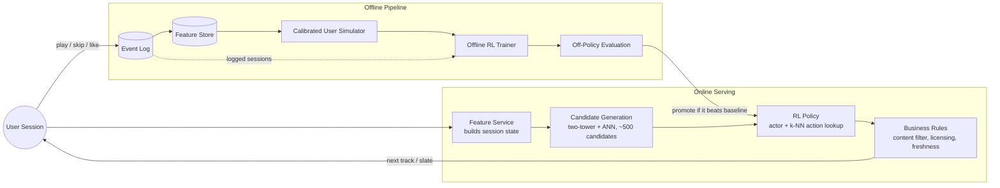

# Song Recommendation System with Reinforcement Learning — Project Plan

A spec-driven implementation plan for a session-aware, RL-based song recommender. Written to be handed to an agentic coding tool (Google Antigravity in mind, but tool-agnostic) rather than executed by hand.

---

## 0. Using this doc with Antigravity

Antigravity works best off a clear spec with acceptance criteria, not a pre-written implementation — the agent drafts its own **Task List** and **Implementation Plan** artifacts and you review those, so don't try to out-plan it. Practical steps:

1. Drop this file at your repo root as `PROJECT_PLAN.md`.
2. Open the repo in the Antigravity IDE (or Antigravity 2.0's standalone app). Set your artifact review policy to **Review-driven** — this project runs training jobs and touches a data pipeline, so you want to see each Implementation Plan before it executes, not just the Walkthrough after.
3. Treat each Milestone in Section 7 as one agent task. First prompt to try:

   > "Read PROJECT_PLAN.md. Scope Milestone 0 (repo scaffold + data ingestion) — draft a Task List and Implementation Plan against its stated acceptance criteria before touching any files."

4. Review the Implementation Plan and, later, the Walkthrough before starting the next milestone — milestones 3 onward assume earlier ones are merged.
5. Milestones 3–5 are sequential in this doc but largely independent in *implementation detail*. If you want to compare two RL algorithm variants, that's a good spot to run two agents in parallel via the Agent Manager.

---

## 1. Objective, Scope & Assumptions

**Objective:** build a next-track / playlist recommender that optimizes for long-term listening satisfaction — not just immediate click-through — by framing recommendation as a sequential decision problem and training an RL policy on top of it.

**Assumptions this plan makes** (flag anything that doesn't match your situation and the milestones below adjust easily):

- No live streaming service or real user telemetry is available, so the plan is built around a **public dataset + a simulator calibrated to it**, with a clean seam to swap in real logs later.
- "Done" means: an RL agent that measurably beats a non-RL baseline *inside the simulator*, plus honest off-policy evidence it would likely do so on real logs — not a claim that it's ready for production traffic. Actual online rollout is scoped as a stretch goal (Milestone 6), because that's a genuinely different, higher-stakes project.
- Solo-developer / single-machine scale, buildable over roughly 2–4 weeks with an agentic coding tool doing most of the typing. Section 10 notes what changes at real streaming-service scale.

**Definition of done:**

- [ ] Simulator grounded in real listening statistics (not hand-picked probabilities)
- [ ] RL policy that beats a strong non-RL baseline inside that simulator
- [ ] An offline / off-policy evaluation report, including where the RL policy might *not* yet be trustworthy
- [ ] A runnable demo comparing baseline vs. RL recommendations

---

## 2. System Architecture



Two loops: an **online loop** (fast path, serves recommendations) and an **offline loop** (trains and validates the policy before it's ever allowed to touch the online loop). The policy is never trained directly against live traffic in this plan — everything ships through the simulator and off-policy evaluation first.

---

## 3. MDP Formulation

```python
# State: everything the policy conditions on at decision time
State = {
    "user_embedding":   np.ndarray,   # (d,) static taste vector, from the two-tower model
    "session_encoding": np.ndarray,   # (d,) GRU/Transformer over the last k (track, response) pairs
    "context": {                      # small dense/one-hot context vector
        "hour_of_day": int, "device": str, "day_of_week": int,
    },
    "session_stats": {                # running signal for the current session
        "skip_rate_so_far": float, "likes_so_far": int, "tracks_played": int,
    },
}

# Action: one of ~500-1000 shortlisted candidates from ANN retrieval —
# NOT the full multi-million-track catalog (the catalog is too large to
# treat as a flat discrete action space; see Section 6).
Action = TrackId  # or list[TrackId] of length k for slate/playlist mode

# Reward: computed after observing the user's response to the recommended track
def compute_reward(event: PlaybackEvent, session_history: list[PlaybackEvent]) -> float:
    r = 0.0
    if event.skip_type == "no_skip":
        r += 1.0
    elif event.skip_type == "skip_early":      # skipped in the first ~5s — strong negative signal
        r -= 1.0
    elif event.skip_type == "skip_late":       # skipped after 30s+ — mild negative
        r -= 0.2

    r += 2.0 * event.liked
    r += 1.5 * event.saved_to_playlist

    recent = session_history[-3:]
    if any(e.artist == event.artist for e in recent):
        r -= 0.3                                # repetition / fatigue penalty
    r += 0.1 * genre_novelty_bonus(event.genre, [e.genre for e in recent])

    return r

def genre_novelty_bonus(genre, recent_genres):
    return 0.0 if genre in recent_genres else 1.0

# Episode: one listening session. Terminates on explicit session end,
# ~30 min of inactivity, or app close.
```

**Discount factor:** start with `gamma = 0.9–0.95`. High enough to value the rest of the session, not so high that the agent over-optimizes for hypothetical future sessions it can't reliably predict.

**Delayed reward note:** session-level and next-day-return signals matter but are sparse. Don't try to hand-tune weights for them upfront — bootstrap them via TD-learning (let the value function propagate credit backward) rather than hard-coding a "day-2 return" term into the immediate reward.

---

## 4. Data Strategy

The dataset most people reach for here — Spotify's Sequential Skip Prediction / Music Streaming Sessions Dataset — was pulled from public download in mid-2024, so don't burn time chasing it; AIcrowd now points requests to Spotify Research directly.

**Recommended primary dataset: KKBox's Music Recommendation Challenge (Kaggle, still downloadable via the Kaggle API/CLI).** It has user listening logs, rich song metadata (genre, artist, composer, lyricist, language), user metadata (age, city), and an explicit repeat-listen-within-30-days label — a usable proxy for satisfaction even without frame-by-frame skip timestamps.

**Fallback / supplement: Last.fm listening-history datasets** (implicit play counts, no login/download gate) — useful for a second, independent check that the simulator's popularity and genre-affinity statistics aren't an artifact of one dataset.

What each is used for:

| Dataset | Used for |
|---|---|
| KKBox | Primary: fits the simulator's response model (Milestone 2), trains the two-tower retrieval model (Milestone 1) |
| Last.fm | Cross-check: validates that affinity/popularity statistics generalize beyond KKBox |

Since neither dataset has genuine within-session skip timestamps, engineer a session proxy: group each user's plays into sessions by a time-gap threshold (e.g., a new session after 30+ minutes of inactivity), and treat "repeat-listen / long play" vs. "single short play, never returned to" as a stand-in for "no_skip" vs. "skip." Document this proxy explicitly in the eval report (Milestone 4) — it's an approximation, and being upfront about it matters more than pretending it's ground truth.

---

## 5. Simulated Environment

```python
import gymnasium as gym

class SongRecEnv(gym.Env):
    """
    Session-level simulator. User-response probabilities are NOT hand-picked —
    they're fit from real listening logs (Milestone 2) so the simulator's
    skip/like rates match observed behavior instead of an arbitrary guess.
    """
    def __init__(self, catalog, response_model, max_session_len=50):
        self.catalog = catalog                 # song embeddings + metadata
        self.response_model = response_model   # P(skip/like | state, action), fit from data
        self.max_session_len = max_session_len

    def reset(self, seed=None):
        self.user = sample_synthetic_user(seed)  # taste vector + mood/context, drawn from real user clusters
        self.history = []
        self.t = 0
        return self._get_state(), {}

    def step(self, action_track_id):
        event = self.response_model.sample(self.user, self.history, action_track_id)
        reward = compute_reward(event, self.history)
        self.history.append(event)
        self.t += 1
        terminated = event.session_end or self.t >= self.max_session_len
        return self._get_state(), reward, terminated, False, {"event": event}

    def _get_state(self):
        ...  # builds the State dict from self.user + self.history, per Section 3
```

Validate this against `gymnasium.utils.env_checker.check_env` and, more importantly, against reality: plot simulated skip-rate and session-length distributions next to the real ones from Section 4's data. If they diverge noticeably, the response model — not the RL agent — is the thing to fix first.

---

## 6. Modeling Approach

**Two-stage design**, because the action space (the full catalog) is too large for a flat discrete policy:

1. **Candidate generation** — a two-tower model (user/session tower + song tower) trained with an implicit-feedback contrastive loss, indexed with FAISS for fast approximate nearest-neighbor retrieval. Shortlists ~500–1000 candidates from the full catalog. This is Milestone 1's baseline, and it stays in the pipeline permanently — the RL layer re-ranks its output, it doesn't replace it.
2. **RL re-ranking / selection** — a **Wolpertinger-style actor-critic**: the actor outputs a continuous "proto-action" embedding in song-embedding space, a k-NN lookup finds the nearest real candidates from step 1, and the critic scores among those to pick the final action. This is the standard way to do actor-critic RL over a huge discrete action space without enumerating it.

**Alternative worth knowing about:** if you want to recommend a whole slate/playlist at once rather than one next-track, **SlateQ** decomposes slate-level Q-values into per-item Q-values under a user-choice model, and is usually easier to train stably than scoring entire slates jointly.

**Offline RL note:** because you can't safely explore on real users, prefer training the policy inside the calibrated simulator (Milestone 3) over pure batch RL on static logs. As a comparison point, also try an offline algorithm like **CQL** or **BCQ** (both implemented in `d3rlpy`) directly on the logged sessions — the gap between "trained in simulator" and "trained via offline RL on logs" is itself an informative result for the eval report.

**Suggested starting hyperparameters** (tune from here, don't treat as final):

| Param | Starting value |
|---|---|
| `gamma` | 0.93 |
| Session encoder | 2-layer GRU, hidden size 128 |
| Actor/critic hidden layers | [256, 128] |
| Candidate shortlist size (k) | 500 |
| Learning rate | 3e-4 (Adam) |
| Replay buffer | 200k transitions, simulator-generated |

---

## 7. Milestone Plan

### Milestone 0 — Foundations
- [ ] Repo scaffold (uv/poetry, pre-commit, pytest, CI)
- [ ] Download + parse the KKBox dataset (Kaggle API); Last.fm as a secondary pull
- [ ] Feature store: song metadata table + starting song embeddings (metadata-based to start; audio embeddings are a stretch goal)
- [ ] Data validation tests (schema, nulls, no leakage across time-based train/val/test splits)

**Acceptance criteria:** `pytest` passes; a script prints row counts and a sample of joined user–song–event records; train/val/test splits are time-ordered with a documented cutoff.

### Milestone 1 — Baseline (non-RL) recommender
- [ ] Two-tower retrieval model (user tower + song tower), implicit-feedback contrastive loss
- [ ] FAISS index over the song tower's embeddings
- [ ] Offline eval harness: Recall@k, NDCG@k on held-out sessions
- [ ] Log baseline numbers — this is the bar every RL variant has to clear

**Acceptance criteria:** Recall@50 and NDCG@10 reported on a held-out split; retrieval latency benchmarked (<50 ms for k=500).

### Milestone 2 — Calibrated simulator
- [ ] Fit a response model `P(skip/like/save | state, candidate)` on real data (gradient-boosted trees or a small NN) — this becomes the simulator's "user"
- [ ] Implement `SongRecEnv` per Section 5
- [ ] Validate simulated vs. real skip-rate and session-length distributions
- [ ] Unit tests: reward bounds, determinism under a fixed seed, episode termination

**Acceptance criteria:** a short report/notebook comparing simulated vs. real aggregate statistics; `check_env` passes.

### Milestone 3 — RL agent
- [ ] Session encoder (GRU/small Transformer) over recent (track, response) pairs
- [ ] Wolpertinger-style actor-critic (start with plain DQN over the Milestone-1 shortlist if you want a simpler first pass, then extend)
- [ ] Train primarily inside the simulator; add an offline CQL/BCQ run on logged sessions as a comparison
- [ ] Track training curves (episode reward, TD-error) in W&B or MLflow

**Acceptance criteria:** mean simulated episode reward beats the Milestone-1 baseline (served greedily in the same simulator) by a stated margin; training is reproducible from one config file.

### Milestone 4 — Offline evaluation & off-policy checks
- [ ] Off-policy evaluation (importance sampling **and** doubly robust) comparing the learned policy to the logging policy on held-out real sessions
- [ ] Reward-weight ablation (diversity bonus off, fatigue penalty off — one at a time)
- [ ] Guardrail report: skip rate, session length, catalog coverage / artist concentration (Gini coefficient), RL vs. baseline

**Acceptance criteria:** a written eval report with all of the above, plus an explicit ship/don't-ship recommendation and the reasoning behind it.

### Milestone 5 — Demo & serving
- [ ] FastAPI inference endpoint: given a synthetic user + recent history, return a next-track or 10-track slate
- [ ] Small Streamlit UI: pick a synthetic listener persona, compare baseline vs. RL side by side
- [ ] Latency benchmark for the full retrieval → policy → rules pipeline
- [ ] README with the architecture diagram and reproduction steps

**Acceptance criteria:** the demo runs end-to-end locally in one command; p95 latency is documented.

### Milestone 6 — Stretch: shadow mode / continual learning
- [ ] Shadow-log the RL policy's decisions against a synthetic multi-session user population without serving them
- [ ] Scheduled retraining job (Antigravity's scheduled tasks, or plain cron) re-running Milestones 3–4 on a cadence
- [ ] A small guardrail dashboard tracking skip rate, diversity, and artist concentration over time

---

## 8. Evaluation Metrics Reference

| Layer | Metric | Notes |
|---|---|---|
| Retrieval | Recall@k, NDCG@k | vs. held-out session next-track |
| Simulator | Mean episode reward, skip rate, session length | RL policy vs. baseline, same simulator |
| Off-policy (real logs) | IPS and doubly-robust estimate of policy value | Corrects for the logs coming from a different (logging) policy |
| Guardrails | Artist/genre concentration (Gini), catalog coverage, novelty rate | Catches "collapses to recommending only mega-hits" |
| Serving | p50 / p95 latency | Target < 100 ms end-to-end |

---

## 9. Repo Structure

```
song-rl-recommender/
├── README.md
├── PROJECT_PLAN.md              # this file
├── pyproject.toml
├── data/
│   ├── raw/
│   └── processed/
├── src/
│   ├── data/                    # ingestion + feature engineering
│   ├── env/                     # SongRecEnv simulator
│   ├── models/
│   │   ├── retrieval.py         # two-tower model
│   │   ├── encoders.py          # session/state encoders
│   │   └── actor_critic.py      # RL policy + critic
│   ├── training/
│   │   ├── train_baseline.py
│   │   └── train_rl.py
│   ├── eval/
│   │   ├── offline_eval.py
│   │   └── ope.py                # off-policy evaluation
│   └── serving/
│       ├── api.py                # FastAPI app
│       └── demo_app.py           # Streamlit demo
├── tests/
└── notebooks/                    # exploration only, not source of truth
```

---

## 10. Tech Stack

- **Language/runtime:** Python 3.11+
- **Modeling:** PyTorch
- **RL:** custom actor-critic training loop; `d3rlpy` for the offline-RL comparison (CQL/BCQ)
- **Retrieval/ANN:** FAISS
- **Experiment tracking:** Weights & Biases or MLflow
- **Data processing:** pandas or polars
- **Env simulation:** Gymnasium API
- **Serving demo:** FastAPI + Streamlit
- **Testing:** pytest

---

## 11. Risks & Mitigations

| Risk | Mitigation |
|---|---|
| Reward hacking — policy games the reward proxy (e.g., favors addictive-but-low-quality tracks) | Keep guardrail metrics separate from the training reward; human-review the Milestone 4 ablations before any ship decision |
| Filter bubble / low diversity | Explicit novelty term in the reward, plus monitored catalog coverage as a guardrail, not just a training signal |
| Cold start (new users/songs) | Fall back to the Milestone-1 baseline until enough interaction history exists |
| Feedback loop (model trained on its own biased logs) | Keep an exploration slice in any logged/online traffic; prefer simulator-first training over pure offline RL on self-generated logs |
| Simulator drifts from real users | Re-run the Milestone-2 validation periodically against fresh real data |
| Off-policy evaluation bias or high variance | Cap importance weights; report both IPS and doubly-robust rather than trusting either alone |

---

## 12. Key Papers & Further Reading

- Dulac-Arnold et al., *Deep Reinforcement Learning in Large Discrete Action Spaces* (2015) — the Wolpertinger architecture used in Section 6.
- Ie et al., *SlateQ: A Tractable Decomposition for Reinforcement Learning with Recommendation Sets* (IJCAI 2019).
- Chen et al., *Top-K Off-Policy Correction for a REINFORCE Recommender System* (WSDM 2019) — YouTube's approach to off-policy correction at scale.
- Fujimoto et al., *Off-Policy Deep Reinforcement Learning without Exploration* (2019) — BCQ.
- Kumar et al., *Conservative Q-Learning for Offline Reinforcement Learning* (2020) — CQL.

---

## 13. Stretch Goals

- Audio-embedding song towers (CNN over mel-spectrograms) instead of metadata-only embeddings
- Learn reward weights via inverse RL from real skip/like data instead of hand-tuning them
- UCB-style exploration bonus at the retrieval stage
- Contextual-bandit baseline as a middle ground between Milestone 1 and the full RL agent
- Real streaming ingestion (Kafka) as a drop-in replacement for the batch event log
