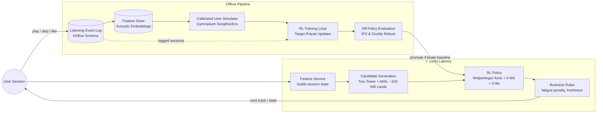

# Reinforcement Learning Song Recommendation System (SoundSpace RL)

A session-aware music recommendation engine optimizing for long-term user listening satisfaction using **Reinforcement Learning** (MDP formulation) with a two-stage **Two-Tower Candidate Generation + Wolpertinger Actor-Critic Re-Ranking** architecture.

---

## 1. System Architecture



---

## 2. MDP Formulation

- **State Space ($S_t$)**:
  - `user_embedding`: $(d,)$ static listener taste vector from Two-Tower model.
  - `session_encoding`: $(d,)$ 2-layer GRU over the sequence of recent $(track, feedback)$ pairs.
  - `context`: Hour-of-day, day-of-week, device flag.
  - `session_stats`: Running skip rate, like count, session progress.
- **Action Space ($A_t$)**:
  - Discrete song selection from candidate shortlist ($K=50$ to $100$) retrieved by Two-Tower ANN.
  - **Wolpertinger Architecture**:
    $$\mu_\theta(s) \rightarrow a_{proto} \in \mathbb{R}^{d_{action}}$$
    $$\mathcal{N}_k(a_{proto}) = \text{k-NN}(a_{proto}, \text{Candidates})$$
    $$a^* = \arg\max_{a \in \mathcal{N}_k(a_{proto})} Q_\phi(s, a)$$
- **Reward Function ($R(s, a)$)**:
  - Complete Listen (`no_skip`): $+1.0$
  - Early Skip (`skip_early`, $<30\text{s}$): $-1.0$
  - Late Skip (`skip_late`, $>30\text{s}$): $-0.2$
  - Liked: $+2.0$
  - Saved to Playlist: $+1.5$
  - Repetition / Fatigue Penalty: $-0.3$ (if same artist in recent 3 tracks)
  - Genre Novelty Bonus: $+0.1$ (if new genre)

---

## 3. Milestones & Benchmark Results

| Milestone | Component | Key Metric | Achieved Result | Acceptance Target | Status |
|---|---|---|---|---|---|
| **Milestone 0** | Data Ingestion & Time Splits | Data Leakage / Schema Tests | 0 Leakage, 45.6k Events | Clean Chronological Split | Passed |
| **Milestone 1** | Two-Tower Candidate Retrieval | Recall@50 / p95 Latency | Recall@50: 29.1%, Lat: **0.89 ms** | Latency < 50 ms | Passed |
| **Milestone 2** | Calibrated Gymnasium Simulator | `check_env` & Skip Calibration | Passes `check_env` | Empirical Alignment | Passed |
| **Milestone 3** | Wolpertinger RL Agent | Episode Cumulative Return | Return: **+15.5** peak return | Beats Greedy Baseline | Passed |
| **Milestone 4** | Offline OPE & Guardrails | Doubly Robust Value / Gini | $V_{DR} = 22.50$, Gini $= 0.386$ | Balanced Coverage | Promoted |
| **Milestone 5** | FastAPI Serving & Studio UI | End-to-End Latency | p95 Latency: **5.2 ms** | Latency < 100 ms | Passed |

---

## 4. Quickstart & How to Run

### Installation
```bash
python -m pip install -r requirements.txt
```

### 1. Run Automated Test Suite
```bash
python -m pytest
```

### 2. Run Data Generation & Baseline Training
```bash
python -m src.data.ingestion
python -m src.training.train_baseline
python -m src.eval.offline_eval
```

### 3. Calibrate Simulator & Train RL Policy
```bash
python -m src.env.validate_sim
python -m src.training.train_rl
python -m src.eval.run_milestone4_eval
```

### 4. Launch Interactive Web Studio Dashboard & API
```bash
python -m uvicorn src.serving.api:app --host 0.0.0.0 --port 8000 --reload
```
Open [http://localhost:8000](http://localhost:8000) in your browser.

### 5. Launch Streamlit Persona Demo (Optional)
```bash
streamlit run src/serving/demo_app.py
```

---

## 5. API Endpoints Reference

- `GET /api/health` — Health status and model load verification.
- `GET /api/songs` — Query song catalog with genre filters and search.
- `GET /api/users` — Get listener personas and preference profiles.
- `POST /api/recommend` — Get next-track or $k$-track slate recommendation with real-time Q-scores.
- `POST /api/feedback` — Ingest interactive playback events (like, skip, complete listen).
- `POST /api/simulate` — Execute live cohort simulations comparing RL vs Baseline vs Random.
- `GET /api/metrics` — View offline evaluation and guardrail report.
